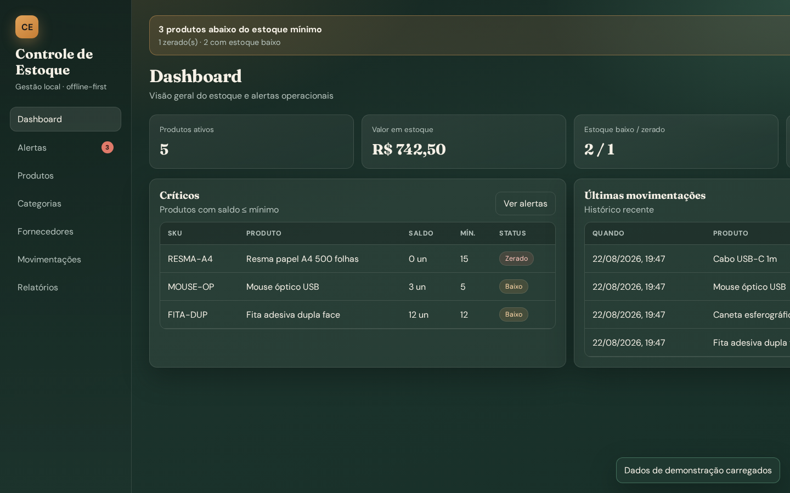
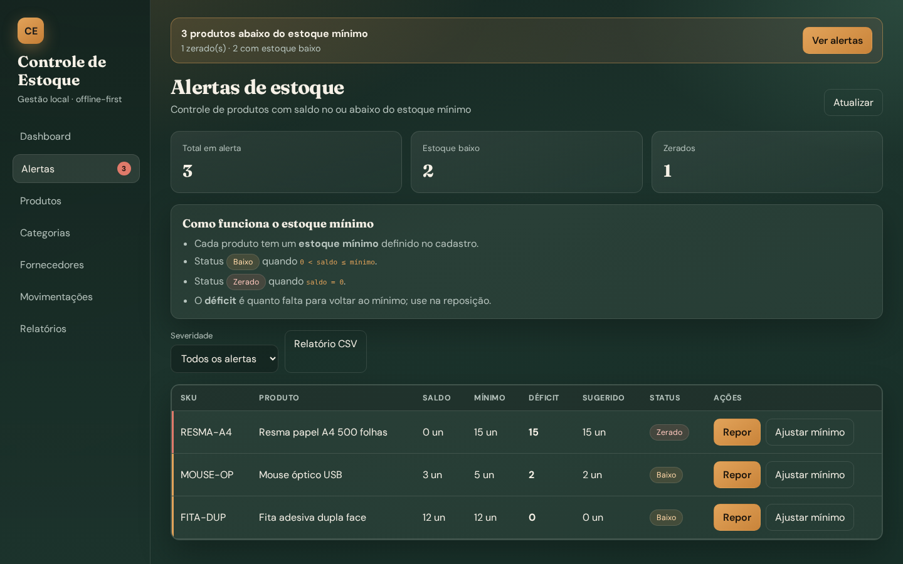
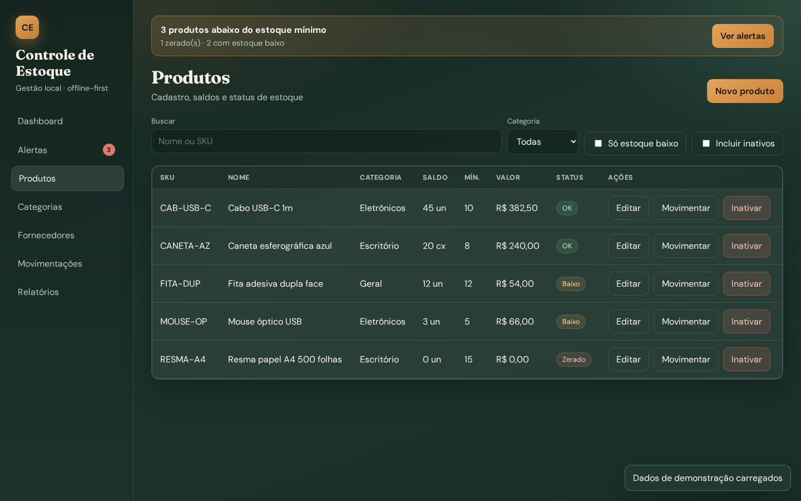
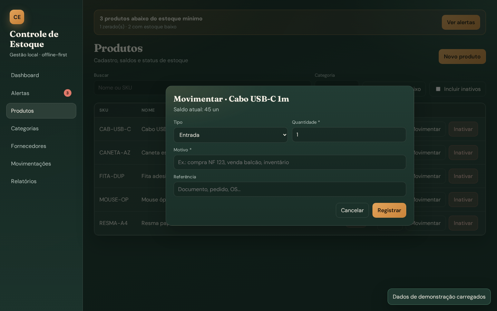
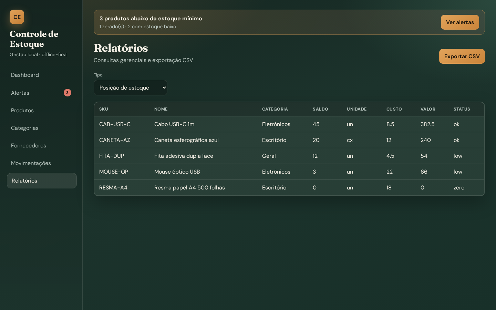

# Controle de Estoque

Aplicativo **desktop** (Electron + React + TypeScript + SQLite) para gestão de estoque offline.

## Documentação

- [Requisitos detalhados](docs/REQUISITOS.md)
- [Fluxos do sistema](docs/FLUXOS.md)
- [Capturas de tela](docs/screenshots/)

### Preview das telas











Demais capturas: primeiro uso, formulário de produto, categorias, fornecedores, histórico e ajuste de mínimo — em `docs/screenshots/`.

## Funcionalidades

- Dashboard com indicadores e alertas de estoque baixo
- Cadastro de produtos, categorias e fornecedores
- Movimentações: entrada, saída e ajuste (histórico imutável)
- Relatórios com exportação CSV
- Persistência local SQLite (modo Electron) ou memória (preview no navegador)

## Pré-requisitos

- Node.js 20+
- npm 10+

## Como executar

```bash
npm install
npm run dev
```

Isso sobe o Vite e abre a janela Electron.  
Para preview só no navegador (API em memória):

```bash
npm run dev
# abra http://127.0.0.1:5173 se a janela Electron não estiver disponível
```

## Scripts

| Comando | Descrição |
|---------|-----------|
| `npm run dev` | Desenvolvimento (Vite + Electron) |
| `npm run build` | Build de produção (renderer + main) |
| `npm start` | Abre o app a partir do build |
| `npm test` | Testes unitários das regras de estoque |
| `npm run typecheck` | Verificação TypeScript |
| `npm run electron:build` | Empacota instalador (electron-builder) |

## Fluxo rápido sugerido

1. Abrir o app → aceitar dados demo (opcional)
2. Cadastrar categorias e fornecedores
3. Cadastrar produtos (com estoque inicial se houver)
4. Registrar entradas/saídas/ajustes
5. Acompanhar alertas no dashboard e exportar relatórios

## Stack

- Electron 33
- React 19 + React Router
- Vite 6
- better-sqlite3
- TypeScript 5
