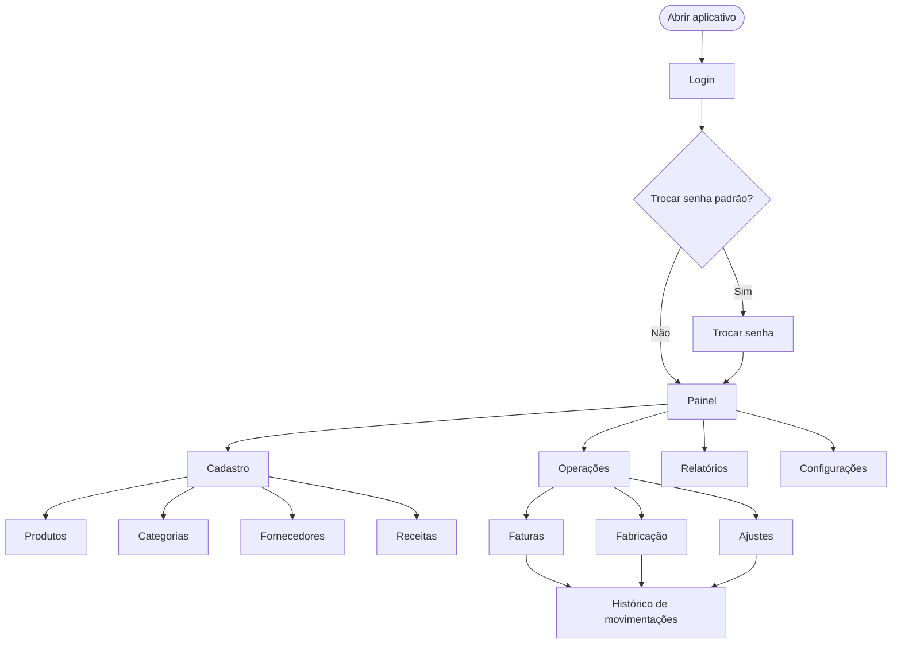
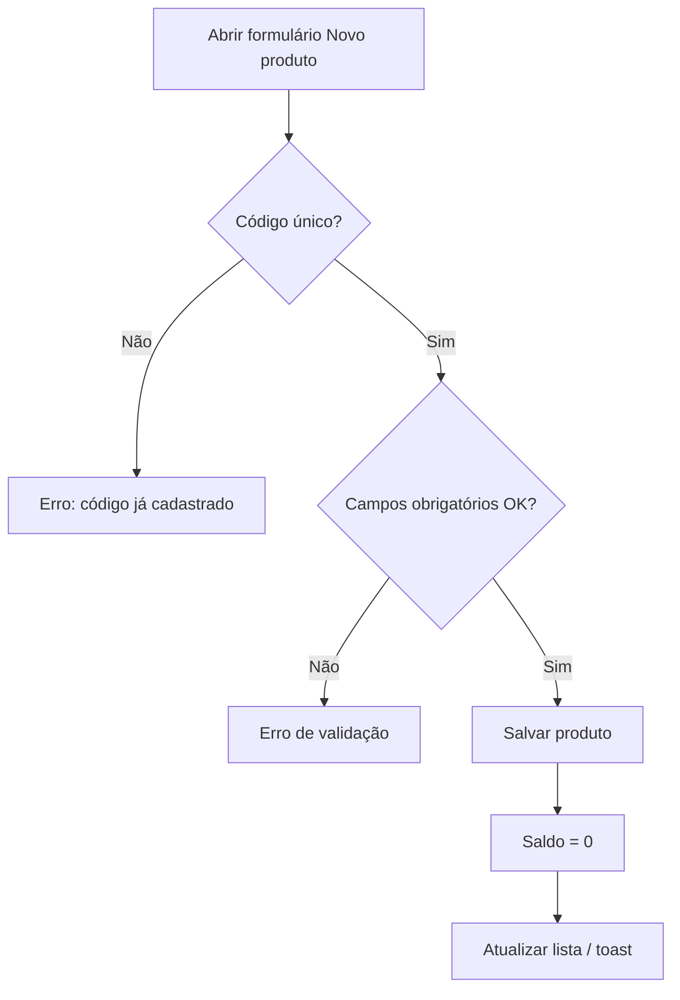
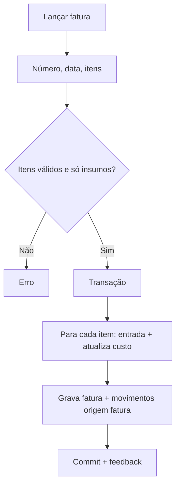
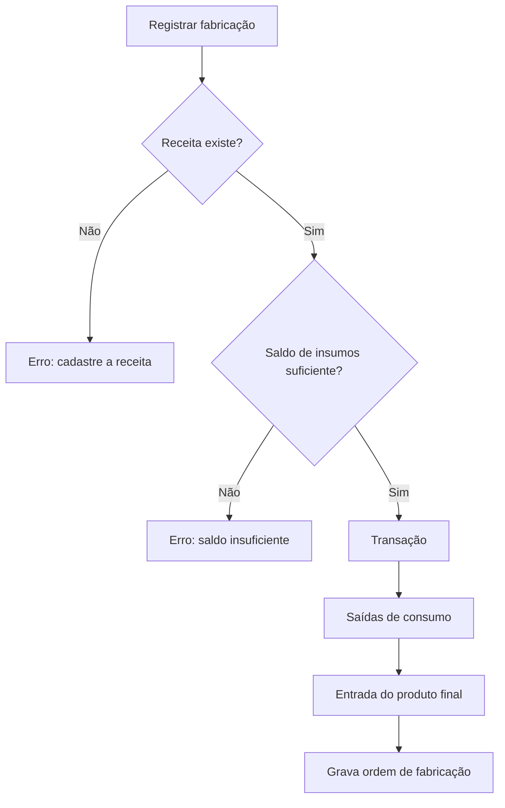

# Fluxos Operacionais — Controlo de Stock

## Convenções

- Cada fluxo tem **pré-condições**, **passos**, **validações**, **resultado** e **alternativas**.
- Telas: `Painel`, `Produtos`, `Categorias`, `Fornecedores`, `Clientes`, `Receitas`, `Faturas de compra`, `Faturas de saída`, `Fabricação`, `Movimentos`, `Inventário físico`, `Relatórios`, `Configurações`.
- Persistência: SQLite local via IPC do Electron (ou API em memória no modo web).

---

## F01 — Inicialização e acesso

**Pré-condições:** App instalado; diretório de dados acessível.

| Passo | Ação | Sistema |
|------:|------|---------|
| 1 | Usuário abre o executável | Carrega schema SQLite; cria tabelas se não existirem; garante admin padrão |
| 2 | Informa usuário e senha | Autentica; rejeita inativos ou credenciais inválidas |
| 3 | Se `mustChangePassword` | Exibe tela de troca de senha (bloqueia o restante do app) |
| 4 | Senha ok | Abre `Painel` |
| 5 | Admin no primeiro uso | Oferece dados de demonstração (aceitar / começar vazio) |

**Resultado:** Sessão autenticada; painel com indicadores.

**Alternativa A1:** Falha ao abrir banco → mensagem clara e log.

**Credenciais iniciais:** `admin` / `admin123` (troca obrigatória).

---

## F02 — Cadastrar categoria

**Pré-condições:** Usuário autenticado; menu Cadastro → Categorias.

| Passo | Ação | Sistema |
|------:|------|---------|
| 1 | Clica em “Nova categoria” | Abre formulário |
| 2 | Informa nome e descrição | Valida nome obrigatório e único |
| 3 | Confirma | Persiste e atualiza lista |

**Validações:** nome não vazio; nome único (case-insensitive).

**Resultado:** Categoria ativa disponível no cadastro de produtos.

---

## F03 — Cadastrar fornecedor

**Pré-condições:** Usuário autenticado; Cadastro → Fornecedores.

| Passo | Ação | Sistema |
|------:|------|---------|
| 1 | Clica em “Novo fornecedor” | Abre formulário |
| 2 | Preenche nome (obrigatório) e contatos | Valida campos |
| 3 | Confirma | Persiste e atualiza lista |

**Resultado:** Fornecedor disponível para produtos e faturas.

---

## F04 — Cadastrar produto

**Pré-condições:** Preferencialmente existir categoria.

| Passo | Ação | Sistema |
|------:|------|---------|
| 1 | Em `Produtos`, clica “Novo produto” | Abre formulário |
| 2 | Preenche código, nome, tipo (insumo/produto final), unidade, preços, mínimo, categoria, fornecedor | Valida |
| 3 | Confirma | Insere produto com **saldo 0** (sem movimento) |

**Campos obrigatórios:** código, nome, unidade, tipo, estoque mínimo (≥ 0), preço de custo (≥ 0).

**Resultado:** Produto ativo na listagem com saldo zero.

---

## F05 — Editar / inativar produto

| Passo | Ação | Sistema |
|------:|------|---------|
| 1 | Seleciona produto → “Editar” | Carrega formulário |
| 2 | Altera dados cadastrais | Código permanece único |
| 3a | Salva | Atualiza cadastro; **não** altera saldo |
| 3b | Inativa | `ativo = 0`; some dos seletores de operação |

**Alternativa:** Reativar → `ativo = 1`.

---

## F06 — Entrada por fatura de compra

**Pré-condições:** Ao menos um **insumo** ativo.

| Passo | Ação | Sistema |
|------:|------|---------|
| 1 | Operações → Faturas de compra → “Lançar fatura” | Abre formulário |
| 2 | Informa número, data, fornecedor, itens (insumo, qtd, custo) | Valida |
| 3 | Confirma | Transação: fatura + entradas de estoque |

**Bloqueios:** produto final na fatura; quantidade ≤ 0; número duplicado para o mesmo fornecedor.

**Resultado:** Saldo dos insumos aumentado; histórico com origem “Fatura”.

---

## F07 — Receita e fabricação

**Pré-condições:** **Produto final** ativo; insumos ativos com saldo.

### F07a — Cadastrar receita

| Passo | Ação | Sistema |
|------:|------|---------|
| 1 | Cadastro → Receitas → nova/editar | Abre formulário |
| 2 | Seleciona produto final e insumos com quantidade por unidade | Valida |
| 3 | Salva | Uma receita por produto final |

### F07b — Registrar fabricação

| Passo | Ação | Sistema |
|------:|------|---------|
| 1 | Operações → Fabricação | Lista ordens |
| 2 | Informa produto final, quantidade, observações | — |
| 3 | Confirma | Consome receita × qtd e credita o produto final |

**Mensagem típica:** “Saldo insuficiente de {insumo}. Necessário: X, disponível: Y.”

**Resultado:** Insumos reduzidos; produto final aumentado; histórico com origem de fabricação.

---

## F08 — Ajuste de inventário

**Pré-condições:** Produto ativo; usuário conferiu o saldo físico.

| Passo | Ação | Sistema |
|------:|------|---------|
| 1 | Operações → Ajustes de inventário → “Novo ajuste” | Mostra saldo atual |
| 2 | Informa **novo saldo** (≥ 0) e motivo | — |
| 3 | Confirma | `diff = novo − atual`; movimento tipo ajuste |

**Uso típico:** inventário físico, correção de divergência.

**Nota:** A mesma tela lista o histórico completo (fatura, fabricação e ajustes), com filtros.

---

## F09 — Painel gerencial

Ao entrar (e após mutações relevantes), o sistema calcula:

1. Produtos ativos  
2. Valor total em estoque (Σ saldo × custo)  
3. Itens com estoque baixo / zerado  
4. Movimentações de hoje  
5. Top 5 críticos + últimas movimentações  

Somente **administrador** vê o banner de dados de demonstração no primeiro uso.

---

## F10 — Relatórios e exportação CSV

| Passo | Ação | Sistema |
|------:|------|---------|
| 1 | Escolhe tipo (posição, movimentações, estoque baixo) | Monta tabela |
| 2 | Aplica filtros de período (quando aplicável) | Atualiza preview |
| 3 | Clica “Exportar CSV” | Salva arquivo UTF-8 |

---

## F11 — Configurações e administração

| Passo | Ação | Quem |
|------:|------|------|
| 1 | Alterar senha | Qualquer usuário |
| 2 | Tema claro/escuro | Qualquer usuário |
| 3 | Usuários (criar / ativar / inativar) | Admin |
| 4 | Marca da empresa (nome + logo ≤ 2 MB) | Admin |
| 5 | Exportar / restaurar cópia de segurança | Admin |
| 6 | Verificar atualizações | Admin |
| 7 | Consultar diagnóstico e gerar pacote de suporte redigido | Admin |

**Resultado:** Preferências e administração local sem sair do app.

---

## F12 — Estorno de operação confirmada

**Pré-condições:** Administrador autenticado; compra, venda ou fabrico no estado `confirmado`.

| Passo | Ação | Sistema |
|------:|------|---------|
| 1 | Abre o documento e seleciona “Estornar” | Solicita motivo com pelo menos cinco caracteres |
| 2 | Confirma o motivo | Verifica se existe saldo para reverter a operação |
| 3 | Confirma | Cria movimentos inversos, altera estado para `estornado` e grava auditoria |

**Resultado:** o documento original é preservado; não há eliminação nem edição destrutiva.

## F13 — Inventário físico

| Passo | Ação | Sistema |
|------:|------|---------|
| 1 | Abre sessão | Congela a posição de referência dos produtos ativos |
| 2 | Regista contagens | Calcula diferenças sem alterar o stock |
| 3 | Submete e aprova | Administrador gera ajustes automáticos auditáveis |

**Resultado:** relatório da sessão e movimentos com origem `inventario_fisico`.

---

## Matriz fluxo × requisitos

| Fluxo | Requisitos atendidos |
|-------|----------------------|
| F01 | RF-A01, RF-A02, RF-D04, RNF-02, RNF-03, RNF-07 |
| F02 | RF-C01, RF-C02 |
| F03 | RF-F01..03 |
| F04 | RF-P01, RF-P02, RF-P06, RF-P07 |
| F05 | RF-P03, RF-P04 |
| F06 | RF-I01..05, RF-M03, RF-M04 |
| F07 | RF-RC01..03, RF-FB01..05, RNF-05 |
| F08 | RF-M01, RF-M02, RF-M05 |
| F09 | RF-D01..03 |
| F10 | RF-R01..04 |
| F11 | RF-A03..06, RF-S01..04 |
| F12 | RF-I05, RF-FB05, RF-M03, RF-M04 |
| F13 | Governança de inventário físico e RF-M01 |
