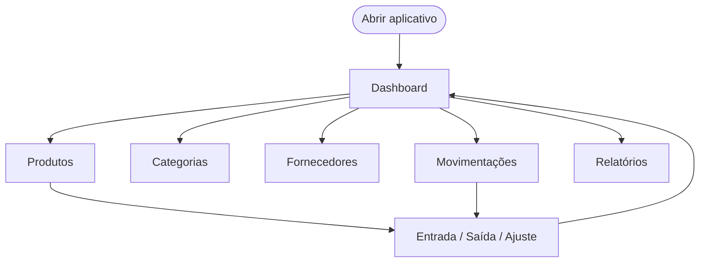
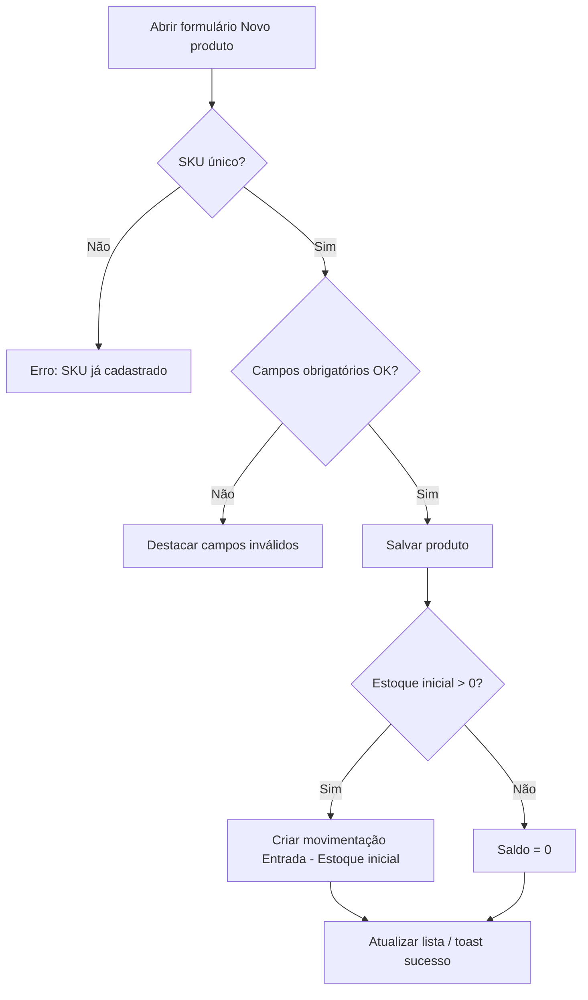
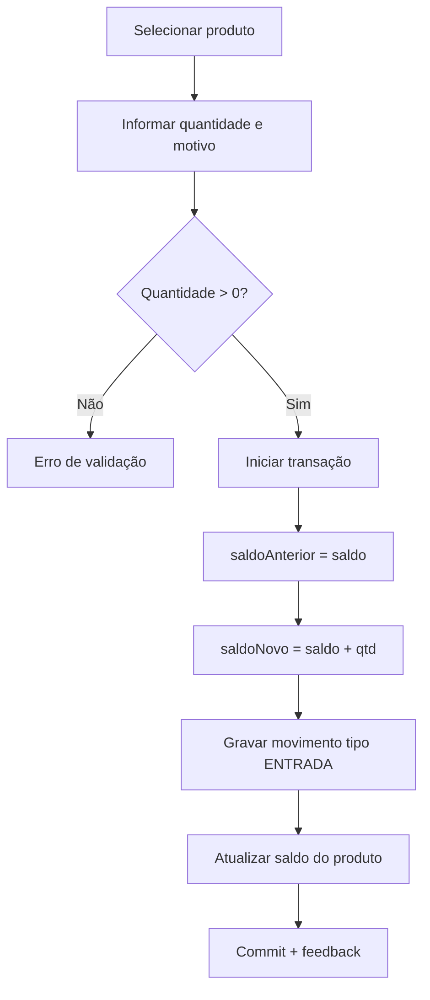
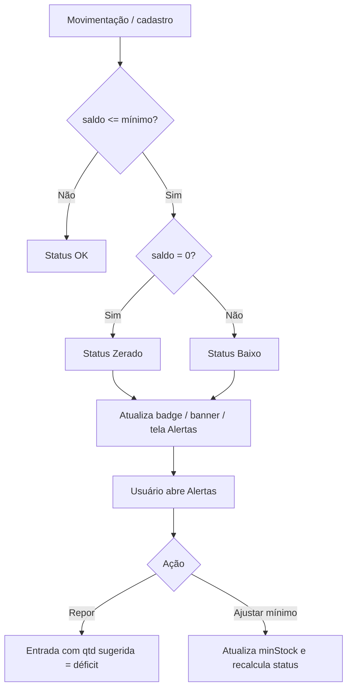

# Controle de Estoque — Fluxos do Sistema

## Convenções

- Cada fluxo tem **pré-condições**, **passos**, **validações**, **resultado** e **alternativas**.
- Telas: `Dashboard`, `Produtos`, `Categorias`, `Fornecedores`, `Movimentações`, `Relatórios`.
- Persistência: SQLite local via camada IPC do Electron.

---

## F01 — Inicialização do aplicativo

**Pré-condições:** App instalado; diretório de dados acessível.

| Passo | Ação | Sistema |
|------:|------|---------|
| 1 | Usuário abre o executável | Carrega schema SQLite; cria tabelas se não existirem |
| 2 | — | Se banco vazio, oferece seed de demonstração |
| 3 | Usuário aceita ou recusa seed | Popula dados exemplo (se aceito) |
| 4 | — | Navega para `Dashboard` |

**Resultado:** Tela inicial com indicadores atualizados.

**Alternativa A1:** Falha ao abrir banco → mensagem “Não foi possível abrir o banco de dados” e encerra com log.

---

## F02 — Cadastrar categoria

**Pré-condições:** Estar em `Categorias`.

| Passo | Ação | Sistema |
|------:|------|---------|
| 1 | Clica em “Nova categoria” | Abre formulário |
| 2 | Informa nome e descrição | Valida nome obrigatório e único |
| 3 | Confirma | Persiste e atualiza lista |

**Validações:** nome não vazio; nome único (case-insensitive).

**Resultado:** Categoria ativa disponível no cadastro de produtos.

---

## F03 — Cadastrar fornecedor

**Pré-condições:** Estar em `Fornecedores`.

| Passo | Ação | Sistema |
|------:|------|---------|
| 1 | Clica em “Novo fornecedor” | Abre formulário |
| 2 | Preenche nome (obrigatório) e contatos | Valida campos |
| 3 | Confirma | Persiste e atualiza lista |

**Resultado:** Fornecedor disponível para vínculo em produtos.

---

## F04 — Cadastrar produto

**Pré-condições:** Preferencialmente existir ao menos uma categoria (pode ser “Geral”).

| Passo | Ação | Sistema |
|------:|------|---------|
| 1 | Em `Produtos`, clica “Novo produto” | Abre formulário |
| 2 | Preenche SKU, nome, unidade, preços, mínimo, categoria, fornecedor | Valida em tempo real |
| 3 | Opcionalmente informa estoque inicial | — |
| 4 | Confirma | Transação: insert produto (+ movimento se inicial > 0) |

**Campos obrigatórios:** SKU, nome, unidade, estoque mínimo (≥ 0), preço de custo (≥ 0).

**Resultado:** Produto ativo na listagem com saldo correto.

---

## F05 — Editar / inativar produto

| Passo | Ação | Sistema |
|------:|------|---------|
| 1 | Seleciona produto → “Editar” | Carrega formulário |
| 2 | Altera dados cadastrais | SKU permanece único |
| 3a | Salva | Atualiza cadastro; **não** altera saldo |
| 3b | Inativa | Marca `ativo = 0`; remove de seletores de movimentação |

**Alternativa:** Tentativa de reativar → `ativo = 1` novamente.

---

## F06 — Entrada de estoque

**Pré-condições:** Produto ativo selecionado.

**Resultado:** Saldo aumentado; histórico com saldo anterior/posterior.

---

## F07 — Saída de estoque

**Pré-condições:** Produto ativo com saldo > 0.

| Passo | Ação | Sistema |
|------:|------|---------|
| 1 | Seleciona produto e tipo “Saída” | Exibe saldo disponível |
| 2 | Informa quantidade e motivo | — |
| 3 | Confirma | Se `qtd > saldo` → **rejeita** sem alterar dados |
| 4 | Se válido | Transação: movimento SAÍDA + atualiza saldo |

**Mensagem de bloqueio:** “Saldo insuficiente. Disponível: X.”

---

## F08 — Ajuste de estoque

**Pré-condições:** Produto ativo; usuário tem o saldo físico contado.

| Passo | Ação | Sistema |
|------:|------|---------|
| 1 | Seleciona produto e tipo “Ajuste” | Mostra saldo atual |
| 2 | Informa **novo saldo** (≥ 0) e motivo | — |
| 3 | Confirma | `diff = novo - atual`; grava movimento AJUSTE; atualiza saldo |

**Uso típico:** inventário físico, correção de divergência.

---

## F09 — Consultar movimentações

| Passo | Ação | Sistema |
|------:|------|---------|
| 1 | Abre `Movimentações` | Lista ordenada por data desc |
| 2 | Aplica filtros (período, produto, tipo) | Recarrega lista |
| 3 | Visualiza detalhes | Somente leitura |

---

## F10 — Dashboard gerencial

Ao entrar (e após qualquer mutação relevante), o sistema recalcula:

1. Qtd. produtos ativos  
2. Valor total em estoque (Σ saldo × custo)  
3. Itens com estoque baixo / zerado  
4. Movimentações de hoje  
5. Top 5 críticos + últimas 8 movimentações  

---

## F11 — Relatórios e exportação CSV

| Passo | Ação | Sistema |
|------:|------|---------|
| 1 | Escolhe tipo de relatório | Monta tabela conforme RF-R01..03 |
| 2 | Aplica filtros | Atualiza preview |
| 3 | Clica “Exportar CSV” | Diálogo “Salvar como…” + grava arquivo UTF-8 |

---

## F12 — Alertas e controle de estoque mínimo

**Pré-condições:** Produtos ativos com `minStock` definido.

| Passo | Ação | Sistema |
|------:|------|---------|
| 1 | Abre `Alertas` | Lista produtos com saldo ≤ mínimo; calcula déficit e sugerido |
| 2 | Filtra por severidade (todos / baixo / zerado) | Atualiza lista |
| 3a | Clica **Repor** | Modal de entrada com quantidade = sugerido |
| 3b | Clica **Ajustar mínimo** | Atualiza `minStock` sem alterar saldo |
| 4 | Confirma | Recalcula status; banner/badge atualizam |

**Regras:** déficit = max(0, mínimo − saldo); sugerido = déficit (se zerado, pelo menos o mínimo).

## Matriz fluxo × requisitos

| Fluxo | Requisitos atendidos |
|-------|----------------------|
| F01 | RNF-02, RNF-03, RNF-07 |
| F02 | RF-C01, RF-C02 |
| F03 | RF-F01..03 |
| F04 | RF-P01, RF-P05, RF-P06 |
| F05 | RF-P02, RF-P03 |
| F06 | RF-M01, RF-M04, RF-M05 |
| F07 | RF-M02, RF-M04, regras de negócio 1 |
| F08 | RF-M03, RF-M04 |
| F09 | RF-M06 |
| F10 | RF-D01..04 |
| F11 | RF-R01..04 |
| F12 | RF-D05..09 |
