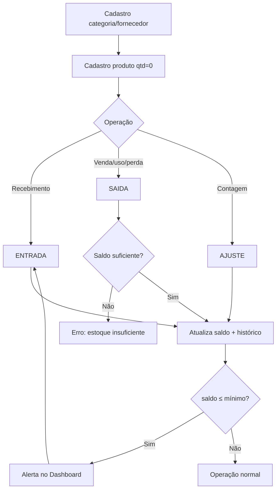

# Fluxos operacionais — ControleEstoque

## Convenções

- **Pré-condição**: o que precisa ser verdade antes do fluxo.
- **Pós-condição**: estado garantido ao final com sucesso.
- **Exceção**: caminho de erro e comportamento esperado.
- Setas `→` indicam transição de tela ou passo.

---

## F0 — Inicialização do aplicativo

```
[Abrir app]
    → Main process cria/abre SQLite no userData
    → Aplica migrations (schema idempotente)
    → Se banco vazio → seed demonstração
    → Janela carrega UI → rota padrão: Dashboard
```

**Pós-condição:** schema válido; pelo menos 1 usuário lógico (`Operador`); UI pronta.

---

## F1 — Cadastrar categoria

```
Menu Categorias → "Nova categoria"
    → Preencher nome (obrigatório) + descrição
    → Salvar
        ├─ OK → lista atualizada + toast sucesso
        └─ Nome duplicado → erro "Já existe uma categoria com este nome"
```

**Pós-condição:** categoria ativa disponível no select de produtos.

---

## F2 — Cadastrar fornecedor

```
Menu Fornecedores → "Novo fornecedor"
    → Preencher nome + contatos opcionais
    → Salvar
        ├─ OK → lista atualizada
        └─ Nome vazio/duplicado → erro de validação
```

---

## F3 — Cadastrar produto (sem estoque inicial)

```
Menu Produtos → "Novo produto"
    → SKU, nome, unidade, mín., custo, preço [, categoria, fornecedor, local]
    → Validar SKU único e valores ≥ 0
    → Salvar
        ├─ OK → produto com quantity_on_hand = 0
        └─ SKU duplicado → erro
```

**Importante:** estoque inicial **não** é campo do cadastro. Use **F4 (Entrada)**.

---

## F4 — Entrada de estoque (compra / recebimento)

```
Pré: produto ativo existe

Menu Movimentos → "Nova movimentação" → tipo ENTRADA
    → Selecionar produto (busca por SKU/nome)
    → Informar quantidade (> 0)
    → [Opcional] fornecedor, custo unitário, observação
    → Confirmar
        → BEGIN TRANSACTION
            → Ler saldo atual (saldo_antes)
            → Inserir stock_movement (ENTRADA)
            → quantity_on_hand += qty
            → Se custo informado → atualizar cost_price (custo médio ponderado)
            → COMMIT
        → Atualizar Dashboard / alertas
```

**Custo médio ponderado:**
```
novo_custo = ((saldo_antes * custo_atual) + (qty * custo_entrada)) / (saldo_antes + qty)
```
Se `saldo_antes = 0`, `novo_custo = custo_entrada`.

**Exceções:**
- Produto inativo → rejeitar
- qty ≤ 0 → rejeitar

**Pós-condição:** saldo maior; movimento append-only criado.

---

## F5 — Saída de estoque (venda / consumo / perda)

```
Pré: produto ativo com saldo suficiente

Movimentos → tipo SAIDA
    → Produto + quantidade + motivo (VENDA | USO_INTERNO | PERDA | OUTRO)
    → Observação (obrigatória se motivo = OUTRO)
    → Confirmar
        → BEGIN TRANSACTION
            → saldo_antes = quantity_on_hand
            → Se qty > saldo_antes → ROLLBACK + erro "Estoque insuficiente"
            → Inserir movimento SAIDA
            → quantity_on_hand -= qty
            → COMMIT
        → Se novo_saldo ≤ min_stock → produto entra em alerta
```

**Pós-condição:** saldo reduzido; histórico com motivo.

---

## F6 — Ajuste de inventário (contagem física)

```
Pré: contagem física realizada

Movimentos → tipo AJUSTE
    → Produto + novo saldo absoluto (≥ 0) + motivo obrigatório
    → Confirmar
        → BEGIN TRANSACTION
            → delta = novo_saldo − saldo_antes
            → Inserir movimento AJUSTE (quantidade = |delta|, meta com novo_saldo)
            → quantity_on_hand = novo_saldo
            → COMMIT
```

**Pós-condição:** saldo igual à contagem; auditoria com antes/depois.

---

## F7 — Monitorar estoque crítico

```
Dashboard
    → Cards: alertas, valor do inventário, produtos ativos
    → Tabela "Críticos" (quantity_on_hand ≤ min_stock)
    → Clique no produto → Produtos filtrado / detalhe

OU Relatórios → "Estoque crítico" → visualizar / exportar CSV
```

**Decisão operacional sugerida:** para cada crítico, abrir **F4 (Entrada)** com o fornecedor preferencial.

---

## F8 — Consultar histórico

```
Movimentos → filtros (período, tipo, produto)
    → Lista paginada / rolável
    → Exportar CSV do filtro atual (Relatórios)
```

Registros são **somente leitura** — não há edição nem exclusão de movimentos.

---

## F9 — Exportar relatório CSV

```
Relatórios → escolher tipo
    → [Opcional] período / filtros
    → "Exportar CSV"
    → Diálogo "Salvar como…" (Electron dialog.showSaveDialog)
    → Gravar arquivo UTF-8 com BOM (compatível Excel BR)
```

---

## Diagrama geral (ciclo de vida do estoque)



---

## Matriz de telas × fluxos

| Tela | Fluxos |
|------|--------|
| Dashboard | F0, F7 |
| Categorias | F1 |
| Fornecedores | F2 |
| Produtos | F3, F7 |
| Movimentos | F4, F5, F6, F8 |
| Relatórios | F7, F8, F9 |
