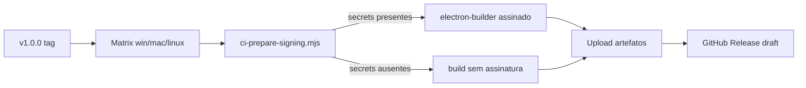

# Guia de Assinatura Digital e Notarização

Guia para configurar assinatura de código e notarização nos releases corporativos via GitHub Actions.

---

## Visão geral

| Plataforma | Método | Obrigatório para produção |
|------------|--------|---------------------------|
| **Windows** | Authenticode (certificado EV ou OV) | Sim |
| **macOS** | Developer ID + notarização Apple | Sim |
| **Linux** | GPG para `.deb` (AppImage não exige) | Recomendado |

Sem os secrets configurados, o workflow `release.yml` gera instaladores **sem assinatura** (adequado para QA interno).

---

## Secrets do GitHub

Configure em **Settings → Secrets and variables → Actions** do repositório.

### Windows

| Secret | Descrição | Como gerar |
|--------|-----------|------------|
| `WIN_CSC_LINK` | Certificado `.p12` codificado em **base64** | `base64 -w0 certificado.p12` (Linux) ou `[Convert]::ToBase64String([IO.File]::ReadAllBytes("cert.p12"))` (PowerShell) |
| `WIN_CSC_KEY_PASSWORD` | Senha do arquivo `.p12` | Fornecida pela CA |

**Certificado recomendado:** Authenticode EV (Extended Validation) — reduz alertas do SmartScreen.

### macOS

| Secret | Descrição | Como gerar |
|--------|-----------|------------|
| `MAC_CSC_LINK` | Developer ID Application `.p12` em base64 | Exportar do Keychain Access → codificar em base64 |
| `MAC_CSC_KEY_PASSWORD` | Senha do `.p12` | Definida na exportação |
| `APPLE_ID` | Apple ID da conta developer | developer.apple.com |
| `APPLE_APP_SPECIFIC_PASSWORD` | Senha de app específica | appleid.apple.com → Segurança → Senhas de app |
| `APPLE_TEAM_ID` | Team ID (10 caracteres) | developer.apple.com → Membership |

A notarização é executada automaticamente pelo `electron-builder` quando todos os secrets Apple estão presentes.

### Linux (opcional)

| Secret | Descrição | Como gerar |
|--------|-----------|------------|
| `LINUX_GPG_PRIVATE_KEY` | Chave privada GPG em base64 | `gpg --armor --export-secret-keys KEY_ID \| base64 -w0` |
| `LINUX_GPG_PASSPHRASE` | Senha da chave GPG | Definida na criação da chave |

### Telemetria (opcional)

| Secret | Descrição |
|--------|-----------|
| `SENTRY_DSN` | DSN do projeto Sentry para crash reporting em builds de release |

---

## Preparar certificado Windows (exemplo)

```powershell
# Exportar certificado do Windows Certificate Store para .p12
# Depois codificar:
[Convert]::ToBase64String([IO.File]::ReadAllBytes("C:\certs\controle-estoque.p12")) | Set-Clipboard
# Colar o valor em WIN_CSC_LINK no GitHub
```

## Preparar certificado macOS (exemplo)

```bash
# Exportar Developer ID Application do Keychain como .p12
base64 -i DeveloperID.p12 | pbcopy   # macOS — colar em MAC_CSC_LINK
```

## Preparar chave GPG Linux (exemplo)

```bash
gpg --full-generate-key
# Tipo: RSA, 4096 bits, e-mail corporativo

gpg --armor --export-secret-keys SEU_KEY_ID | base64 -w0
# Colar em LINUX_GPG_PRIVATE_KEY
```

---

## Fluxo no CI



Script: `scripts/ci-prepare-signing.mjs` — decodifica certificados base64 para arquivos temporários e exporta variáveis `CSC_*` para o `electron-builder`.

---

## Build local assinado

### Windows

```powershell
$env:CSC_LINK = "C:\certs\controle-estoque.p12"
$env:CSC_KEY_PASSWORD = "senha"
npm run electron:build:release
```

### macOS

```bash
export CSC_LINK="$HOME/certs/DeveloperID.p12"
export CSC_KEY_PASSWORD="senha"
export APPLE_ID="dev@empresa.com"
export APPLE_APP_SPECIFIC_PASSWORD="xxxx-xxxx-xxxx-xxxx"
export APPLE_TEAM_ID="XXXXXXXXXX"
npm run electron:build:release
```

---

## Verificação pós-build

### Windows

```powershell
Get-AuthenticodeSignature "release\Controle de Estoque Setup 1.0.0.exe"
# Status deve ser Valid
```

### macOS

```bash
spctl -a -vv -t install "release/Controle de Estoque-1.0.0.dmg"
# Deve retornar accepted e source=Notarized Developer ID
codesign -dv --verbose=4 "release/mac/Controle de Estoque.app"
```

### Linux

```bash
dpkg-sig --verify release/controle-estoque_1.0.0_amd64.deb
```

---

## Troubleshooting

| Problema | Causa provável | Solução |
|----------|---------------|---------|
| SmartScreen bloqueia instalador | Sem assinatura EV ou app novo | Configurar `WIN_CSC_LINK`; acumular reputação |
| Gatekeeper bloqueia no macOS | Sem notarização | Verificar secrets Apple; `mac.notarize: true` |
| `CSC_LINK file not found` | Base64 inválido no secret | Re-encode o `.p12`; evitar quebras de linha |
| Notarization failed | Senha de app expirada | Gerar nova em appleid.apple.com |
| `.deb` não assinado | GPG não importado | Verificar `LINUX_GPG_PRIVATE_KEY` e passphrase |

---

## Renovação

| Item | Validade típica | Ação |
|------|-----------------|------|
| Certificado Windows OV/EV | 1–3 anos | Renovar na CA; atualizar `WIN_CSC_LINK` |
| Developer ID Apple | 1 ano | Renovar no Apple Developer; re-exportar `.p12` |
| Senha de app Apple | Até revogação | Rotacionar anualmente |
| Chave GPG Linux | Sem expiração (configurável) | Documentar no runbook |

---

## Referências

- [electron-builder — Code Signing](https://www.electron.build/code-signing)
- [Apple Notarization](https://developer.apple.com/documentation/security/notarizing_macos_software_before_distribution)
- [Guia de Operação e Recuperação](./GUIA-DE-OPERACAO-E-RECUPERACAO.md)
- [Checklist de Lançamento](./CHECKLIST-DE-LANCAMENTO-V1.0.0.md)
