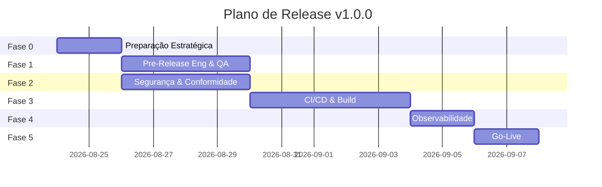

# Plano de Produção Corporativo — Controle de Estoque v1.0.0

Plano de ação para release de produção do aplicativo **desktop** Controle de Estoque, adaptado ao stack real do projeto.

## Contexto do produto

| Item | Valor |
|------|-------|
| **Tipo** | Aplicativo desktop offline-first |
| **Stack** | Electron 33, React 19, TypeScript 5, Vite 6, better-sqlite3 |
| **Plataformas** | Windows (NSIS), Linux (AppImage/deb), macOS (dmg) |
| **Persistência** | SQLite local em `{userData}/data/estoque.db` (WAL mode) |
| **Distribuição** | Instaladores via electron-builder (`release/`) |
| **Versão alvo** | `1.0.0` (semver) |

> **Nota:** Este produto não possui backend em nuvem na v1. Itens de infraestrutura cloud aplicam-se à **esteira de build/distribuição**, não a servidores de aplicação.

---

## Fase 0 — Preparação Estratégica (Gestão & Produto)

### Ações para Gestão / PMO

- [ ] **[Alta]** Definir critérios de go/no-go e matriz RACI por área (ver [CHECKLIST-GO-NOGO.md](./CHECKLIST-GO-NOGO.md))
- [ ] **[Alta]** Estabelecer janela de release e responsáveis on-call pós-lançamento (72h)
- [ ] **[Alta]** Aprovar política de suporte à v1 (SLA de resposta a incidentes críticos)
- [ ] **[Média]** Comunicar feature freeze e escopo congelado da v1.0.0
- [ ] **[Média]** Agendar retrospectiva D+7 e D+30
- [ ] **[Baixa]** Registrar release no changelog interno

### Ações para Produto (PO / PM)

- [ ] **[Alta]** Validar critérios de aceite de [REQUISITOS.md](./REQUISITOS.md) seção 8 (100% Must)
- [ ] **[Alta]** Congelar backlog — apenas hotfixes entram na release
- [ ] **[Alta]** Preparar release notes para usuários finais (funcionalidades, requisitos de SO)
- [ ] **[Média]** Documentar escopo **fora da v1** (sem login, sem sync, sem multi-depósito)
- [ ] **[Média]** Definir canal de feedback pós-lançamento (e-mail, formulário)
- [ ] **[Baixa]** Planejar roadmap v1.1 (RF-E01 autenticação, backup automático)

---

## Fase 1 — Pre-Release (Engenharia & Qualidade)

### Ações para Engenharia / Tech Lead / Arquitetura

- [ ] **[Alta]** Code review final em 100% dos PRs da release (foco: `electron/db.ts`, IPC, transações)
- [ ] **[Alta]** Validar transações atômicas em movimentações (RNF-05) — entrada/saída/ajuste + saldo
- [ ] **[Alta]** Confirmar ausência de secrets/credenciais no repositório (`git secrets --scan`)
- [ ] **[Alta]** Revisar hardening Electron em `electron/main.ts`:
  - `contextIsolation: true`
  - `nodeIntegration: false`
  - Preload expõe apenas API necessária
  - Links externos via `shell.openExternal` (não `window.open`)
- [ ] **[Alta]** Taggear versão semântica `v1.0.0` e garantir build reproduzível (`package-lock.json` pinned)
- [ ] **[Média]** Refatorar débitos críticos (queries N+1, validações duplicadas)
- [ ] **[Média]** Documentar ADR: SQLite WAL, histórico imutável, soft delete
- [ ] **[Média]** Validar performance com 5.000 produtos (RNF-04: lista < 1s)
- [ ] **[Baixa]** Executar análise SonarQube / ESLint com zero issues Critical

### Ações para QA / Qualidade

- [ ] **[Alta]** Executar suite completa conforme [POLITICA-COBERTURA-TESTES.md](./POLITICA-COBERTURA-TESTES.md)
- [ ] **[Alta]** Rodar `npm test` + `npm run typecheck` — zero falhas
- [ ] **[Alta]** Executar smoke test: `npx tsx scripts/smoke.mts` → deve imprimir `SMOKE_OK`
- [ ] **[Alta]** Testes manuais dos fluxos F01–F11 em [FLUXOS.md](./FLUXOS.md) em build empacotado (não só dev)
- [ ] **[Alta]** Regressão nos critérios de aceite (seção 8 de REQUISITOS.md):
  - SKU duplicado bloqueado
  - Saída acima do saldo bloqueada
  - Dashboard reflete saldo após movimentação
  - Produto inativo fora do seletor
  - Exportação CSV válida (UTF-8 BOM)
  - App inicia offline
- [ ] **[Alta]** Testar em **3 SOs**: Windows 10/11, Ubuntu 22.04+, macOS 13+
- [ ] **[Média]** Teste de resiliência: fechar app durante movimentação → saldo consistente
- [ ] **[Média]** Teste de banco corrompido → mensagem clara (F01 alternativa A1)
- [ ] **[Média]** Validar resolução mínima 1280×720 (RNF-01)
- [ ] **[Baixa]** Teste exploratório em telas secundárias

### Ações para Engenharia (Build)

- [ ] **[Alta]** `npm run build && npm run electron:build` gera artefatos em `release/` sem erro
- [ ] **[Alta]** Validar instaladores por plataforma: NSIS (win), AppImage + deb (linux), dmg (mac)
- [ ] **[Média]** Configurar branch protection: require reviews + status checks
- [ ] **[Baixa]** Gerar SBOM (Software Bill of Materials) do `package-lock.json`

---

## Fase 2 — Segurança & Conformidade (AppSec & Jurídico/Dados)

### Ações para Segurança / AppSec

- [ ] **[Alta]** SAST: `npm audit --audit-level=high` — zero vulnerabilidades High/Critical
- [ ] **[Alta]** Varredura de dependências nativas (better-sqlite3, electron) com Trivy/Grype
- [ ] **[Alta]** Assinatura de código:
  - **Windows:** certificado Authenticode (EV recomendado)
  - **macOS:** Apple Developer ID + notarização
  - **Linux:** GPG para repositório/deb (se distribuição via apt)
- [ ] **[Alta]** Validar que IPC não expõe métodos arbitrários de filesystem/shell
- [ ] **[Alta]** Revisar preload (`electron/preload.ts`) — superfície mínima de API
- [ ] **[Média]** Executar checklist OWASP Desktop App Security (Electron)
- [ ] **[Média]** Desabilitar DevTools em build de produção (`app.isPackaged`)
- [ ] **[Média]** Configurar `Content-Security-Policy` no renderer
- [ ] **[Baixa]** Threat modeling STRIDE documentado (IPC, SQLite, export CSV)

### Ações para Jurídico / DPO / Dados

- [ ] **[Alta]** Mapear dados pessoais tratados localmente:
  - Fornecedores: nome, documento (CNPJ/CPF), telefone, e-mail
  - Dados de estoque: sem PII direta, mas podem conter referências comerciais
- [ ] **[Alta]** Publicar Política de Privacidade (dados **locais**, sem envio a servidores na v1)
- [ ] **[Alta]** Publicar Termos de Uso do software
- [ ] **[Alta]** Documentar que responsabilidade de backup e proteção do arquivo `estoque.db` é do operador
- [ ] **[Média]** Orientar operadores sobre LGPD aplicável a dados de fornecedores (base legal: execução de contrato/interesse legítimo)
- [ ] **[Média]** Incluir cláusula de retenção: dados permanecem enquanto app instalado; exclusão = remover arquivo DB
- [ ] **[Baixa]** Preparar template de resposta a titulares (acesso, exclusão manual via app)

---

## Fase 3 — Infraestrutura & DevOps (SRE & Build)

> Adaptado para **distribuição desktop** — sem servidores de aplicação na v1.

### Ações para DevOps / SRE

- [ ] **[Alta]** Configurar ambientes de build:
  - **Staging (Beta):** builds de `release/*` ou tag `v*-beta` → canal interno QA
  - **Production:** tag `v1.0.0` → canal público de download
- [ ] **[Alta]** Esteira CI/CD (GitHub Actions recomendado):

  ```
  push/PR → lint + typecheck + test → build → electron:build (matrix: win/linux/mac) → upload artifacts
  tag v*  → sign + notarize + publish release
  ```

- [ ] **[Alta]** Estratégia de deploy: **Release imutável por versão** (semver)
  - Rollback = redistribuir instalador da versão anterior (N-1)
  - Manter artefatos de N-1 e N-2 disponíveis por 12 meses
- [ ] **[Alta]** Provisionamento de banco de dados (SQLite local):
  - Schema versionado em `electron/db.ts` (CREATE IF NOT EXISTS)
  - Documentar caminho: `{app.getPath('userData')}/data/estoque.db`
  - Backup manual: copiar `estoque.db` + `estoque.db-wal` + `estoque.db-shm`
  - WAL mode já habilitado (`journal_mode = WAL`)
- [x] **[Alta]** Implementar export/import de backup (Configurações → Exportar/Restaurar)
- [ ] **[Média]** Cache de dependências npm no CI (reduzir tempo de build)
- [ ] **[Média]** Builds reproducíveis: Node 20.x LTS, npm ci (não npm install)
- [x] **[Média]** Configurar auto-update (electron-updater + GitHub Releases)
- [ ] **[Baixa]** Mirror de artefatos em CDN/storage (S3, GitHub Releases)

### Ações para Engenharia (suporte ao pipeline)

- [ ] **[Alta]** Dry-run completo: CI build → artefato → instalação limpa → smoke test
- [ ] **[Alta]** Validar que `npm ci && npm run build && npm run electron:build` funciona em máquina limpa
- [ ] **[Média]** Documentar variáveis de CI necessárias (certificados de assinatura, secrets)
- [ ] **[Baixa]** Feature flags para funcionalidades experimentais (não aplicável na v1)

---

## Fase 4 — Monitoramento & Observabilidade (SRE & Devs)

> Observabilidade adaptada para app desktop sem backend.

### Ações para SRE / DevOps

- [ ] **[Alta]** Configurar `SENTRY_DSN` e validar crash reporting (integrado em `electron/telemetry.ts`)
- [ ] **[Alta]** Definir SLOs:
  - **Disponibilidade:** app inicia em < 5s em 99% dos casos (hardware referência: 4GB RAM, SSD)
  - **Integridade:** zero perda de dados em crash durante transação (SQLite WAL + transações)
  - **Performance:** lista de produtos < 1s com 5.000 itens (RNF-04)
- [ ] **[Alta]** Configurar alertas internos (equipe):
  - Crash rate > 1% nas primeiras 72h → investigação imediata
  - Falha de build no CI → notificação Slack/e-mail
- [ ] **[Média]** Logs estruturados no main process (níveis ERROR/WARN/INFO)
- [ ] **[Média]** Dashboard interno de crashes (Sentry dashboard)
- [ ] **[Baixa]** Telemetria anônima de uso (opt-in) — versão, SO, contagem de produtos

### Ações para Engenharia (Devs)

- [ ] **[Alta]** Instrumentar erros de IPC com contexto (handler, payload sanitizado)
- [ ] **[Alta]** Log de falha ao abrir banco (F01-A1) com path e código de erro
- [ ] **[Média]** Correlation ID por sessão do app (UUID gerado no startup)
- [ ] **[Média]** Documentar troubleshooting por erro comum (ver [RUNBOOK-OPERACAO.md](./RUNBOOK-OPERACAO.md))
- [ ] **[Baixa]** Profiling de startup time em build empacotado

---

## Fase 5 — Go-Live & Produto (PM, PO & UX)

### Ações para Produto / PO

- [ ] **[Alta]** UAT com operadores reais (loja/depósito) em build de staging
- [ ] **[Alta]** Sign-off formal de aceite (CHECKLIST-GO-NOGO assinado)
- [ ] **[Alta]** Release notes publicadas com requisitos mínimos (Node não necessário — app empacotado)
- [ ] **[Média]** FAQ de suporte: instalação, backup, recuperação de dados
- [ ] **[Média]** Guia rápido de primeiro uso (fluxo F01–F04)
- [ ] **[Baixa]** Comunicado de lançamento

### Ações para UX

- [ ] **[Alta]** Validar fluxos principais em build empacotado (não só dev server)
- [ ] **[Média]** Verificar mensagens de erro em português, acionáveis (RNF-06)
- [ ] **[Média]** Validar estados vazios e feedback visual (toasts, badges de status)
- [ ] **[Baixa]** Onboarding do seed de demonstração (F01 passo 2–3)

### Ações para QA (Go-Live)

- [ ] **[Alta]** Smoke tests pós-instalação em cada plataforma:
  1. App abre → Dashboard carrega
  2. Cadastrar produto → saldo correto
  3. Entrada → saldo aumenta
  4. Saída bloqueada se insuficiente
  5. Exportar CSV → arquivo válido
- [ ] **[Alta]** Validar crash reporting recebe eventos de teste
- [ ] **[Média]** Sanidade D+1: reinstalar sobre versão existente preserva dados
- [ ] **[Baixa]** Monitorar feedback nas primeiras 48h

### Ações para DevOps (Execução do Deploy)

- [ ] **[Alta]** Executar checklist go/no-go final
- [ ] **[Alta]** Publicar release `v1.0.0` com artefatos assinados
- [ ] **[Alta]** War room nas primeiras 4h (monitorar crashes, feedback)
- [ ] **[Alta]** Manter instalador v0.9.x (N-1) disponível para rollback
- [ ] **[Média]** Comunicar status a stakeholders a cada milestone
- [ ] **[Média]** Observação intensiva 72h pós-lançamento
- [ ] **[Baixa]** Atualizar runbooks com lições aprendidas

### Ações para Gestão (Go-Live)

- [ ] **[Alta]** Comunicar go-live internamente
- [ ] **[Alta]** Ativar suporte reforçado (72h)
- [ ] **[Média]** Checkpoint D+1 e D+7
- [ ] **[Baixa]** Celebrar lançamento com o time

---

## Cronograma de dependências



> Fases 1 e 2 podem ocorrer em paralelo. Fase 4 deve estar pronta antes do build final de produção.

---

## Riscos e mitigações

| Risco | Probabilidade | Impacto | Mitigação |
|-------|---------------|---------|-----------|
| Perda de dados do usuário | Média | Crítico | Documentar backup manual; transações atômicas; WAL mode |
| Instalador bloqueado por antivírus (false positive) | Média | Alto | Code signing; reportar à Microsoft/VirusTotal |
| better-sqlite3 incompatível com Electron ABI | Baixa | Alto | Pin versions; testar build em matrix CI |
| macOS Gatekeeper rejeita app | Média | Alto | Notarização Apple obrigatória |
| Crash durante movimentação | Baixa | Alto | Transações SQLite; teste de resiliência QA |
| Usuário sem backup perde DB | Média | Crítico | FAQ + orientação na Política de Privacidade |

---

## Documentos relacionados

- [POLITICA-COBERTURA-TESTES.md](./POLITICA-COBERTURA-TESTES.md)
- [CHECKLIST-GO-NOGO.md](./CHECKLIST-GO-NOGO.md)
- [RUNBOOK-OPERACAO.md](./RUNBOOK-OPERACAO.md)
- [REQUISITOS.md](./REQUISITOS.md)
- [FLUXOS.md](./FLUXOS.md)
- [CODE-SIGNING.md](./CODE-SIGNING.md)
